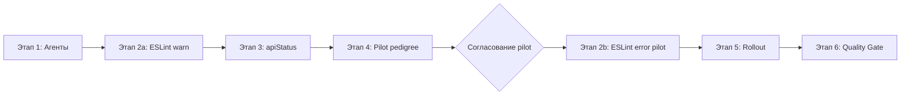

# План: CMS frontend — стандарты кода, ESLint и рефакторинг

**Тикет:** cms_frontend_refactoring_26_05_18  
**Дата:** 2026-05-18  
**Затронутые сервисы:** `services/frontend`; агентские инструкции: `agents/frontend.md`, `agents/planner.md`, `agents/quality_gate.md`  
**Ветка:** `refactor/cms-frontend-standards-26-05-18`  
**Источник задачи:** `docs/tasks/cms_frontend_refactoring_26_05_18.md`  
**Референс ESLint:** `/home/igor/projects/nexora-seo/orchestration/services/fe/eslint.config.mjs`, `eslint.ai.config.mjs`

---

## Контекст

Frontend-разработчик провёл ревью CMS-кода и зафиксировал системные проблемы, которые не блокируются текущим линтером:

| # | Проблема | Пример в коде | Масштаб (оценка) |
|---|---|---|---|
| 1 | Строковые литералы вместо констант/enum | `response.status === "ok"`, `status: "ok"` в тестах | ~40 вхождений `status: "ok"` / сравнений в `src/` |
| 2 | Слишком краткий нейминг | `horses.find((h) => h.id === horseId)` | Точечно, но повторяется в `horses/page.tsx` |
| 3 | Логика в JSX | `selectedHorse && "pedigree" in selectedHorse ? ...`, inline `onClose={() => { ... }}` | `horses/page.tsx:615–622`, другие страницы |
| 4 | Перегруженные функции | `applyMutation` в `useHorsePedigree.ts` (~35 строк, несколько ответственностей) | pedigree hooks + аналоги в других фичах |
| 5 | Inline `style={{}}` для статики | `HorsePedigreePickerModal.tsx` — сетка, отступы, бордеры | ~151 `style={{` в `src/**/*.tsx` |
| 6 | Монолитные UI-файлы | `HorsePedigreePickerModal.tsx` (кандидат-кнопка внутри map) | pedigree UI как эталон «до» |

Текущий `services/frontend/eslint.config.mjs` — только `next/core-web-vitals` + `next/typescript`. `npm run lint` даёт **0 errors, ~15 warnings** и не ловит перечисленные антипаттерны.

В Nexora (`orchestration/services/fe`) уже подключены `eslint-plugin-sonarjs`, `eslint-plugin-unicorn`, ограничения inline handlers, cognitive complexity, `no-magic-numbers`, запрет сравнения со строковыми литералами — это целевой baseline для EqSiteCMS.

**Статус реализации:** этапы 1–4 (pilot) выполнены 2026-05-18. Этап 5 (rollout по всему `src/`) — в очереди.

---

## Цель

1. Зафиксировать единые стандарты CMS frontend в агентских инструкциях, чтобы AI и люди не повторяли антипаттерны.
2. Усилить ESLint в `services/frontend` по образцу Nexora с **поэтапным** включением правил (warn → error).
3. Ввести слой API/UI-констант и хелперы вместо разбросанных строковых литералов.
4. Отрефакторить эталонную зону **родословной лошадей** и вынести orchestration из `horses/page.tsx` в feature-слой.
5. Исправить все нарушения, появившиеся после ужесточения линтера, с зелёными `npm test`, `npm run lint`, `npx tsc --noEmit`, `npm run build`.

### Критерии приёмки

- Агенты `frontend`, `planner`, `quality_gate` содержат обязательные правила code style и ESLint gate.
- `eslint.config.mjs` покрывает: inline JSX handlers, cognitive complexity, magic numbers (для TS), string comparison literals, `react/jsx-no-bind` (строже baseline).
- Есть `src/lib/apiStatus.ts` (или эквивалент) + использование в новом/затронутом коде; тесты используют те же константы.
- `HorsePedigreePickerModal`, `useHorsePedigree`, связанные тесты — эталон «после» (компоненты, стили, разбиение функций).
- `horses/page.tsx`: логика pedigree/modal orchestration вынесена из JSX; нет `(h) =>` в новом коде.
- Quality Gate: lint errors = 0 на затронутом scope; для полного репозитория — отдельный этап 5 с чеклистом файлов.

### Access policy

Backend и endpoint policy **не меняются**. Это refactor Protected Admin CMS UI:

| Flow | Access class | Изменения |
|---|---|---|
| CMS `/horses`, pedigree modals | Protected Admin UI | Только структура кода и UX-стили |
| `GET` pedigree candidates | Public Read (backend) | Без изменений контракта |
| `POST` set pedigree | Protected Write | Без изменений; scope guards сохраняются |

---

## Стандарты кода (норматив для агентов и ревью)

### 1. Строковые литералы

| Категория | Правило | Расположение |
|---|---|---|
| API status (`ok` / `error`) | Только через `API_STATUS` + type guards | `src/lib/apiStatus.ts` |
| Domain enums (`sire`, `dam`, …) | Уже в `HorsePedigreeMode` и типах API — не дублировать строки в UI | `src/types/...` |
| UI copy (русские подписи) | Допустимы как константы рядом с компонентом или в `*Copy.ts` фичи | `src/features/<feature>/` |
| Тестовые ожидания | `toMatchObject({ status: API_STATUS.OK, ... })`, не `"ok"` | `*.test.ts(x)` |

Запрещено: сравнение `response.status === "ok"` и бинарные сравнения со строковыми литералами в TS/TSX (ловит ESLint `no-restricted-syntax` из Nexora).

### 2. Нейминг

| Контекст | Минимум | Пример |
|---|---|---|
| Callback в `find`/`filter`/`map` | Осмысленное имя сущности | `horse`, не `h` |
| Однобуквенные | Только `i`, `j` в числовых циклах | — |
| Boolean | Префикс `is/has/can` | `canUpdatePedigree` ✓ |

### 3. Логика вне JSX

- Условия props (`selectedHorseWithPedigree`) — в hook/container **выше** `return`.
- Обработчики `onClose`, `onChanged` — именованные `useCallback` в hook, не inline block в JSX.
- Запрещены block-bodied / ternary / `&&` inline handlers в `on*` props (ESLint `no-restricted-syntax`).

### 4. Размер функций

- `sonarjs/cognitive-complexity` ≤ 12 (как Nexora).
- `max-lines-per-function` ≤ 300 (warn на этапе 2, error на этапе 3).
- Hook use-case: одна ответственность на функцию (`applyPedigreeMutation`, `refreshHorsePedigree`, `assertCanUpdatePedigree`).

### 5. Стили

| Тип | Подход |
|---|---|
| Статические layout/spacing/border | `createStyles` из `antd-style` (как `MainTable.tsx`) или CSS module |
| Динамические (selected/unselected, compact) | Условные className через `createStyles` variants / `clsx` |
| Запрещено | Статические `style={{ marginBottom: 8 }}` без зависимости от runtime-контекста |

Допустимый минимум inline style: значения из props/state, которых нет в конечном наборе (например, `width: percent` от данных) — с комментарием в PR при спорных случаях.

---

## Детали реализации

### Backend

Изменений нет.

### Этап 1. Агентские инструкции (до массового рефакторинга)

Синхронизировать правила с задачей, чтобы следующие фичи не деградировали.

#### `agents/frontend.md` — новая секция «15. Code style и ESLint»

| Подсекция | Содержание |
|---|---|
| Строковые литералы | `API_STATUS`, запрет `"ok"` в сравнениях |
| Нейминг | Запрет однобуквенных entity aliases |
| JSX | Логика и handlers в hooks |
| Функции | Cognitive complexity, разбиение use-case |
| Стили | antd-style / CSS modules vs inline |
| Команды | `npm run lint` обязателен; при новых правилах — `npm run lint:fix` если добавлен |

#### `agents/planner.md`

- Для refactor/quality планов включать подплан «ESLint rollout» с этапами warn/error.
- В чеклисте Frontend: задачи на константы, pilot feature, page migration.

#### `agents/quality_gate.md`

- Добавить чеклист **Frontend ESLint & code style**:
  - [ ] `npm run lint` — 0 errors
  - [ ] Нет новых inline block handlers в JSX (выборочно `rg` + ESLint)
  - [ ] Нет сравнений со строковыми литералами в TS business logic
  - [ ] Статические inline styles не добавлены в затронутых файлах

### Этап 2. ESLint hardening (`services/frontend`)

#### Новые devDependencies

| Пакет | Версия (ориентир) |
|---|---|
| `eslint-plugin-sonarjs` | как в Nexora |
| `eslint-plugin-unicorn` | как в Nexora |

#### Файлы

| Файл | Назначение |
|---|---|
| `eslint.config.mjs` | CI/dev baseline: правила Nexora, часть на `warn` в подэтапе 2a |
| `eslint.ai.config.mjs` | Строгий профиль для агентов (опционально `lint:ai` script) |
| `package.json` | `"lint:ai": "eslint -c eslint.ai.config.mjs"` |

#### Правила (порт из Nexora)

| Правило | Уровень (2a → 2b) | Зачем |
|---|---|---|
| `no-restricted-syntax` (inline handlers) | warn → error | П.3 задачи |
| `no-restricted-syntax` (string literal comparisons) | warn → error | П.1 задачи |
| `sonarjs/cognitive-complexity` (12) | warn → error | П.4 задачи |
| `max-lines-per-function` (300) | warn | Крупные файлы |
| `max-lines` (500 файл) | warn | Монолиты |
| `no-magic-numbers` | warn (TS only) | П.5, отступы/размеры |
| `react/jsx-no-bind` | warn → error | Inline handlers |
| `unicorn/*` | как Nexora baseline | Качество TS |

#### Подэтап 2a — включение без блокировки CI

1. Добавить плагины и правила в режиме **warn**.
2. Зафиксировать baseline отчёт: `npm run lint 2>&1 | tee docs/reports/cms_frontend_refactoring_26_05_18-lint-baseline.txt` (в рамках реализации).
3. Согласовать с пользователем переход 2b → **error** для правил 1–4 после pilot (этап 3).

#### Подэтап 2b — error на pilot scope

`eslint.config.mjs` overrides:

```javascript
{
  files: [
    "src/features/horses/**/*.{ts,tsx}",
    "src/lib/apiStatus.ts",
  ],
  rules: { /* критичные правила: error */ },
}
```

Остальной `src/` остаётся на warn до этапа 5.

#### Исключения (ограниченные)

| Путь | Причина |
|---|---|
| `**/*.test.ts(x)` | Ослабить `no-magic-numbers`; строки статуса — через `API_STATUS` |
| `next-env.d.ts`, config files | ignores |

### Этап 3. Инфраструктура констант

#### Новые файлы

| Файл | Содержание |
|---|---|
| `src/lib/apiStatus.ts` | `API_STATUS = { OK: "ok", ERROR: "error" } as const`, `isApiSuccess()`, `isApiError()` |
| `src/lib/apiStatus.test.ts` | 3 unit: ok guard, error guard, narrowing |

#### Миграция вызовов (в scope этапа 3–4)

- `useHorsePedigree.ts`, `horseService`, тесты pedigree, затронутые hooks/features.
- Паттерн: `if (isApiSuccess(response)) { ... }` вместо `=== "ok"`.

### Этап 4. Pilot refactor — родословная (эталон)

Приоритет — файлы из отзыва разработчика.

#### 4.1 `useHorsePedigree.ts`

| Было | Станет |
|---|---|
| `applyMutation` | `assertCanUpdatePedigree()`, `submitPedigreeMutation(payload)`, `reloadHorseAfterPedigreeChange()` |
| `response.status === "ok"` | `isApiSuccess(response)` |
| `CANDIDATE_LIMIT = 10` | Оставить; при lint magic numbers — вынести в `PEDIGREE_CANDIDATE_PAGE_SIZE` const |

#### 4.2 `HorsePedigreePickerModal.tsx`

| Компонент | Путь |
|---|---|
| `HorsePedigreeCandidateButton` | `src/features/horses/ui/Horses/HorsePedigreeCandidateButton.tsx` |
| `HorsePedigreePickerPagination` | `.../HorsePedigreePickerPagination.tsx` (chunk nav) |
| Стили | `horsePedigreePickerModal.styles.ts` через `createStyles` |

Modal остаётся тонким: props + composition.

#### 4.3 `HorsePedigreeModal.tsx` / `HorsePedigreeCard.tsx`

- Вынести inline handlers в props из hook (`useHorsePedigreeModal` или расширить существующий container hook).
- Статические стили → `createStyles`.

#### 4.4 `horses/page.tsx` (частичная миграция)

| Действие | Деталь |
|---|---|
| Создать | `src/features/horses/hooks/useHorsesPagePedigree.ts` или расширить существующий horses page hook |
| Вынести | `resolveSelectedHorseWithPedigree(selectedHorse)`, `handlePedigreeModalClose`, `handlePedigreeChanged` |
| JSX | `selectedHorse={selectedHorseWithPedigree}` `onClose={handlePedigreeModalClose}` |
| Нейминг | `(horse) => horse.id === horseId` |

Полная декомпозиция `horses/page.tsx` (777 строк) — **отдельный follow-up** в этапе 5, не блокер pilot.

#### 4.5 Тесты

Обновить существующие:

- `useHorsePedigree.test.ts`
- `HorsePedigreePickerModal.test.tsx`
- `HorsePedigreeModal.test.tsx`
- `HorsePedigreeCard.test.tsx`

Добавить регрессионные тесты на extracted helpers (см. матрицу ниже).

### Этап 5. Rollout по кодовой базе (после согласования pilot)

Порядок фич по убыванию нарушений lint (уточнить по baseline-отчёту):

1. `src/app/(protected)/**/page.tsx` — inline handlers, логика в JSX  
2. `src/features/gallery`, `src/features/news`, `src/features/prices`, `src/features/siteSettings`  
3. `src/ui/**` — inline styles  

Для каждой фичи: поднять ESLint override to `error`, исправить, `npm test`, MR chunk ≤ 15–20 файлов.

### Этап 6. Quality Gate

Отчёт: `docs/reports/cms_frontend_refactoring_26_05_18-review.md`

---

## Frontend test matrix

| Area | Behavior diff | Required tests | Access scenario | Commands |
|---|---|---|---|---|
| `src/lib/apiStatus.ts` | Type guards вместо строк | 3 unit: ok, error, invalid shape | N/A | `npm test -- apiStatus` |
| `useHorsePedigree` | Split mutations + guards | 3+ unit: success refresh, permission denied, API error | scope present / missing | `npm test -- useHorsePedigree` |
| `HorsePedigreePickerModal` | Extracted button, styles | 5 component: empty, loading, select, save disabled, pagination | authenticated + UPDATE_HORSE_PEDIGREE | `npm test -- HorsePedigreePicker` |
| `horses/page` pedigree wiring | Named handlers, no inline close | 2 component/integration: open/close modal, pedigree horse resolution | authenticated | `npm test`, manual QA |
| ESLint regression | Lint rules enforce style | 0 new violations in pilot paths | N/A | `npm run lint` |
| Repo-wide | No behavior change in other features | Existing suite green | N/A | `npm test`, `npm run build` |

### Минимумы по типам (Planner 2.2)

| Тип | Минимум |
|---|---|
| Hook refactor | 3 unit: success, permission error, API error |
| Modal extraction | 5 component: open/close, interaction, error, loading, success path |
| Constants helper | 3 unit |
| Регрессия | 1 тест: `isApiSuccess` used in pedigree mutation path |

---

## Manual QA steps (UI тестирование)

Предусловия: CMS поднят, пользователь с scope `UPDATE_HORSE_PEDIGREE`, есть лошади с/без родословной.

### Desktop (≥1280px)

1. Открыть `/horses` → вкладка «Лошади» → таблица отображается.
2. Открыть родословную лошади → основное модальное окно, карточки sire/dam/foals.
3. «Добавить отца» → picker: поиск, список, пагинация «Назад/Вперед», выбор кандидата, «Сохранить».
4. Убедиться: selected row подсвечивается (border/background), layout не ломается при длинном имени.
5. Заменить мать → picker с subtitle «Заменить мать».
6. Удалить связь (sire/dam/foal) → подтверждение, список обновляется без перезагрузки страницы.
7. Закрыть picker «Отмена» → основное модальное окно остаётся.
8. Закрыть основное модальное окно → таблица лошадей, состояние сброшено.
9. Пользователь без scope: кнопки изменения скрыты/disabled, mutation не уходит (Network).

### Tablet (768px) / Mobile (375px)

10. Picker modal: список кандидатов скроллится, кнопки footer не перекрывают контент.
11. Карточка кандидата: фото/инициал, текст не наезжает на Radio.

### Ошибки

12. Симулировать 403 на POST pedigree (devtools/MSW) → Alert с текстом ошибки, modal не закрывается.
13. Пустой поиск → Empty state с подсказкой.

### Регрессия

14. Создание/редактирование лошади (существующий flow) не сломано.
15. Фото-галерея лошади открывается как раньше.

**Итог QA:** passed/failed по шагам, скриншоты при fail responsive/permission.

---

## Порядок выполнения



1. **Этап 1** — обновить `agents/*.md` (можно параллельно с 2a).  
2. **Этап 2a** — зависимости + eslint config, baseline отчёт.  
3. **Этап 3** — `apiStatus` + тесты.  
4. **Этап 4** — pedigree refactor + тесты + частичная миграция `horses/page.tsx`.  
5. **Согласование** — показать diff pilot пользователю.  
6. **Этап 2b** — error rules на pilot paths.  
7. **Этап 5** — пофичевый rollout (отдельные PR).  
8. **Этап 6** — Quality Gate report.

**Запрещено до согласования плана:** массовые правки вне этапов, ослабление правил без записи в план, изменение backend API.

---

## Риски и mitigations

| Риск | Mitigation |
|---|---|
| ESLint error взрыв (~150+ style, ~40 string compare) | Поэтапно warn → error; pilot scope first |
| Конфликт с Ant Design patterns | `createStyles` как в `MainTable`; не переписывать на Tailwind без причины |
| Регрессия pedigree UX | Существующие 4 test-файла + Manual QA 15 шагов |
| `horses/page.tsx` слишком большой | Частичная миграция в этапе 4; полный container — этап 5 |
| Submodule `services/frontend` | Коммиты в репозитории frontend; монорепо docs/agents — в корне |

---

## Чеклист

> Агенты отмечают `[x]` по мере выполнения **после согласования плана**.

### Агенты и документация

- [x] Обновить `agents/frontend.md` — секция Code style и ESLint
- [x] Обновить `agents/planner.md` — ESLint rollout в refactor-планах
- [x] Обновить `agents/quality_gate.md` — Frontend ESLint & code style checklist

### ESLint

- [x] Добавить `eslint-plugin-sonarjs`, `eslint-plugin-unicorn` в `services/frontend/package.json`
- [x] Расширить `eslint.config.mjs` по образцу Nexora
- [x] Добавить `eslint.ai.config.mjs` и script `lint:ai` (опционально)
- [ ] Снять baseline lint-отчёт
- [x] Включить error-правила для pilot paths (этап 2b)

### Константы и lib

- [x] Создать `src/lib/apiStatus.ts` + `apiStatus.test.ts`
- [x] Мигрировать pedigree feature на `isApiSuccess` / `API_STATUS`

### Pilot: pedigree UI/hooks

- [x] Разбить `applyMutation` в `useHorsePedigree.ts`
- [x] Извлечь `HorsePedigreeCandidateButton` из picker modal
- [x] Перенести статические стили picker/modal в `createStyles`
- [x] Вынести pedigree handlers из `horses/page.tsx` JSX
- [x] Исправить нейминг `(h)` → `(horse)` в затронутых handlers
- [x] Обновить/дополнить unit/component тесты pedigree

### Rollout (этап 5, после pilot)

- [x] Миграция hooks на `API_STATUS` / `isApiSuccess` / `isApiError` (prices, gallery, news, siteSettings, horses sub-hooks, photoSelector, UserContext)
- [x] `AUTH_STATUS` для login/auth
- [x] Page UI hooks: `usePricesPageActions`, `useNewsPageUi`, `useGalleryPageUi`
- [x] `src/ui/filters` — `createStyles`, именованные handlers
- [x] Иконки — объединены duplicate imports
- [ ] Baseline lint-отчёт в `docs/reports/` (опционально)
- [ ] Полный strict ESLint на все `page.tsx` и `client.ts` (следующая итерация)
- [ ] Остальные таблицы/modals — inline styles → `createStyles`

### Quality Gate

- [x] `npm test` — green
- [x] `npm run lint` — 0 errors (`eslint src --quiet`)
- [x] `npx tsc --noEmit` — clean
- [x] `npm run build` — success
- [ ] Self-checks: `rg` fetch/api imports/site-*/pagination (как в `agents/frontend.md`)
- [ ] Manual QA 15 шагов — passed
- [ ] Отчёт `docs/reports/cms_frontend_refactoring_26_05_18-review.md`

---

## Связанные документы

- Задача: `docs/tasks/cms_frontend_refactoring_26_05_18.md`
- Pedigree feature: `docs/plans/feature/horse_pedigree_management.md`
- Testing baseline: `docs/plans/frontend_cms_testing_baseline_26_05_11.md`
- Обязательные тесты в агентах: `docs/plans/frontend_testing_mandatory_agents_26_05_11.md`
