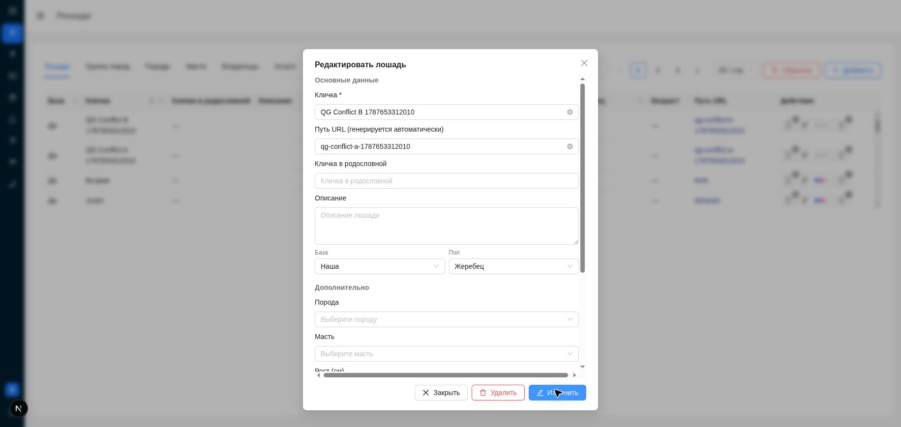

# Review: 056 horse slug bug

**Статус: ✅ APPROVED**  
**Дата:** 2026-08-25

## Итог

Path-scoped Backend/Frontend diff для OpenSpec change
[`fix-056-horse-slug-bug`](../../openspec/changes/fix-056-horse-slug-bug/)
соответствует proposal/design/delta specs, Clean Architecture и FSD boundaries.
Backend unit/lint и targeted horse frontend tests прошли; typecheck, lint и build
frontend прошли. Live API повторно подтвердил Protected Write, Public Read с tenant
selector, смену slug и cleanup в реальной PostgreSQL.

Повторный Quality Gate после test-only исправления подтвердил: все backend/frontend
автоматические gates зелёные, прежний HIGH finding устранён. Полный Manual QA,
включая Chrome conflict/field-error walkthrough, anonymous/no-scope sessions и
responsive viewports, завершён успешно. Implementation findings отсутствуют.

## Связанные артефакты

- Исходная задача: [`docs/tasks/056_horse_slug_bug.md`](../tasks/056_horse_slug_bug.md)
- Proposal: [`proposal.md`](../../openspec/changes/fix-056-horse-slug-bug/proposal.md)
- Design: [`design.md`](../../openspec/changes/fix-056-horse-slug-bug/design.md)
- Backend delta spec: [`spec.md`](../../openspec/changes/fix-056-horse-slug-bug/specs/backend-domain-capabilities/spec.md)
- Frontend delta spec: [`spec.md`](../../openspec/changes/fix-056-horse-slug-bug/specs/cms-horse-ui-quality/spec.md)
- Tasks: [`tasks.md`](../../openspec/changes/fix-056-horse-slug-bug/tasks.md)
- Approval: пользователь подтвердил `Apply` до реализации.

Рекомендуемая ветка: `fix/056-horse-slug-bug`.

## Resolved findings

1. **[RESOLVED][Frontend tests]**
   `services/frontend/src/features/user-management/ui/UserFormModal.test.tsx:87` —
   первоначально полный `npm test` завершался с `1 failed | 66 passed` files и
   `1 failed | 552 passed` tests. Frontend заменил ненадёжное ожидание enabled-state
   на ожидание отсутствия `.ant-btn-loading`; implementation не менялся. Повторный
   полный прогон: **67/67 files, 553/553 tests passed**.

## Remaining findings

Нет.

## Изменения в scope 056

Backend: slug DTO/service normalization and omitted/empty/manual semantics,
tenant-scoped uniqueness, narrow unique-constraint mapping, foreign-tenant denial,
unit/repository tests. Frontend: typed optional slug, modal state/prefill/payload/
field error/maxLength, MSW/component/table regressions.

Проверенный path-scoped набор:

- `services/backend/src/core/entities/base.py`
- `services/backend/src/core/protocols/repositories/horse_repository.py`
- `services/backend/src/core/schemas/horses.py`
- `services/backend/src/core/services/horse.py`
- `services/backend/src/repositories/horse_repository.py`
- backend horse unit/repository tests
- `services/frontend/src/types/api/horses.ts`
- `services/frontend/src/features/horses/validators/horses.ts`
- `services/frontend/src/features/horses/ui/Horses/HorseCreateUpdateModal.tsx`
- frontend horse hook/modal/table tests

Out-of-scope DB migrations, NATS/AsyncAPI и `services/site-*` отсутствуют в
path-scoped diff. В общем worktree есть несвязанные изменения 054/057/callback;
они не приписаны change 056.

## Backend gate

- `make test` (`services/backend`): повторно **1206 passed, 5 skipped**, 0 failed,
  7.87 s.
- `make lint` (`services/backend`): mypy 270 files clean; ruff check clean;
  ruff format check 270 files formatted; flake8 clean.
- Clean Architecture: API/auth dependency не менялись; бизнес-логика осталась в
  `HorseService`; repository доступен через Protocol; SQL только в repository;
  ожидаемые slug errors мапятся в `ClientError`.
- Root `make format` намеренно не запускался: worktree содержит неучтённые
  параллельные изменения, а контракт запрещает mutating format вне clean/path-accounted
  worktree. Scoped format checks прошли.

## Frontend test gate

| Команда | Результат |
|---|---|
| `npm test -- <3 horse test files>` | ✅ 3 files, **115/115** tests |
| `npm test` | ✅ **67/67 files, 553/553 tests** |
| `npm run lint` | ✅ 0 errors; baseline warnings присутствуют |
| `npx tsc --noEmit` | ✅ |
| `npm run build` | ✅ 17 static pages, `/horses` built |

Test quality: slug create/edit/empty, field error, double-submit, scope present/
missing, MSW success/validation/401/403, table slug, pagination `limit/offset` и
reset offset покрыты; tests не выполняют live backend calls.

Self-checks: direct network calls остаются в API boundary; feature UI не получает
новых direct API imports; CMS/site consumer mixing не найден; legacy
`shared/widgets/entities` dirs не созданы. Новых inline block handlers/static styles
в изменённом modal diff нет.

## Access verification results

Access matrix соответствует design/specs:

| Проверка | HTTP | Time | Результат |
|---|---:|---:|---|
| login `POST /api/auth/login` | 200 | 57.774 ms | ✅ cookie auth |
| anonymous `POST /api/horses` | 401 | 2.194 ms | ✅ no write |
| authenticated manual `POST /api/horses` | 200 | 36.308 ms | ✅ normalized slug |
| anonymous `PATCH /api/horses/{id}` | 401 | 1.670 ms | ✅ no mutation |
| authenticated `PATCH /api/horses/{id}` | 200 | 56.137 ms | ✅ slug changed |
| anonymous public detail, valid selector | 200 | 56.848 ms | ✅ Public Read |
| anonymous public list, valid selector | 200 | 34.411 ms | ✅ `total=1` |
| public GET, missing selector | 401 | 2.461 ms | ✅ |
| public GET, invalid selector | 401 | 20.839 ms | ✅ |
| old slug after PATCH | 404 | 56.620 ms | ✅ missing contract |
| authenticated cleanup DELETE | 204 | 28.402 ms | ✅ |

Unit + prior implementation evidence additionally cover no-scope `403`, foreign
tenant `403`, race conflicts and cross-tenant isolation. Исключений из default
access policy нет.

## SMOKE evidence

Перед повторным прогоном прочитан smoke skill и credentials; авторизация выполнена
cookie jar, public GET — без cookie. PostgreSQL discovery выполнен заново:

- label query `project=eqsitecms + service=db` не нашёл core DB;
- fallback: container `eqsitecms-db`, id `7c720ddc783d`, image `postgres:16`;
- compose project `eqsitecms-core`, service `db`, aliases `eqsitecms-db`/`db`;
- database/user `eqsitecms`, host port `5433`.

Параметры получены через текущий `docker inspect`, не копировались из design.
Cleanup подтверждён SQL: `count=0`. Отдельных pytest smoke-файлов в backend tests
не добавлено. Tasks 1.42–1.76 образуют **35 разнообразных live сценариев**:
generation/manual/update/validation/conflict/race/tenant/access/public read/cleanup;
unit slug matrix 1.6–1.40 также содержит **35 сценариев**, а не однотипное наполнение.

## Manual QA

Текущий source проверен на `http://localhost:3000`; `:3001` диагностирован как stale
runtime без slug field. Authenticated SUPERUSER session открыла `/horses`; create
action доступен, slug column видна, modal содержит label/input
`Путь URL (генерируется автоматически)`.

Responsive measurements:

| Viewport | Dialog | Slug input | Footer actions |
|---|---|---|---|
| 1440×900 | 600×790, within viewport | visible, 497 px | visible |
| 768×1024 | 600×914, within viewport | visible, 497 px | visible |
| 390×844 | 374×734, within viewport | visible, 271 px | visible |

Дополнительный фактический evidence:

- UI create с пустым slug: один logical POST (`OPTIONS` + `POST 200`), refresh GET
  `200`; PostgreSQL сохранил generated slug.
- UI create с ручным slug: POST `200`; PostgreSQL сохранил нормализованный slug.
- UI edit prefill: modal показала сохранённый slug.
- UI change + fast double click после auth refresh: кнопка disabled/loading;
  ровно один PATCH `200`. Первый прогон дал ожидаемый auth retry (`401` затем `200`),
  не вторую mutation.
- UI clear через keyboard ввёл `slug:""`; PATCH `200`, PostgreSQL сохранил slug,
  регенерированный из итогового name.
- Anonymous deep link `/horses` перенаправлен на `/login`; modal/add недоступны.
- Existing `USER_MANAGER` smoke user: `/horses` render, create action отсутствует;
  прямой POST вернул `403` за 24.779 ms, PostgreSQL count `0`.
- Network/API failure evidence: duplicate PATCH `400`/25.119 ms,
  `detail=Slug лошади уже занят`; overlength `400`/23.521 ms с field path;
  anonymous PATCH `401`/3.220 ms; public detail нового slug `200`/25.331 ms.
- Новая вкладка пользовательского Chrome на актуальном `:3000`: через UI созданы
  две cleanup-safe записи с разными manual slug; повторный create с slug первой
  записи дал реальный `POST /api/horses` `400`, body
  `{"detail":"Slug лошади уже занят"}`. Modal осталась открыта, slug сохранился,
  у поля показан `validationErrors.slug` с текстом `Slug лошади уже занят`.
- Все четыре созданные QA записи удалены через authenticated DELETE; итоговый
  PostgreSQL count по QA marker равен `0`.
- Две дополнительные Chrome QA записи удалены с `204`/`204`; authenticated list
  после cleanup подтвердил `rowsRemaining=0`.

Полный task 1.89 подтверждён: desktop/tablet/mobile, create/edit, manual slug,
empty regeneration, conflict/field error, double submit/loading, allowed/no-scope,
anonymous redirect и network status/body evidence пройдены.

## OpenSpec validation

- `openspec validate fix-056-horse-slug-bug --strict`: ✅ valid.
- Tasks 1.89–1.97 подтверждены. Task 1.98 намеренно оставлен открытым для Router;
  Quality Gate не выполнял sync/archive. Test finding устранён.

## Quality Gate checklist

- [x] Исправлен flaky wait в `UserFormModal.test.tsx:87`; implementation не менялся,
  полный `npm test` проходит 553/553.
- [x] Обнаружены и проверены anonymous flow и существующий no-scope `USER_MANAGER`.
- [x] Повторены полный `npm test`, lint, typecheck и build — успешно.
- [x] Завершён Manual QA 1.89, включая UI conflict/field-error в Chrome.
- [x] Итоговый единый review: APPROVED.
