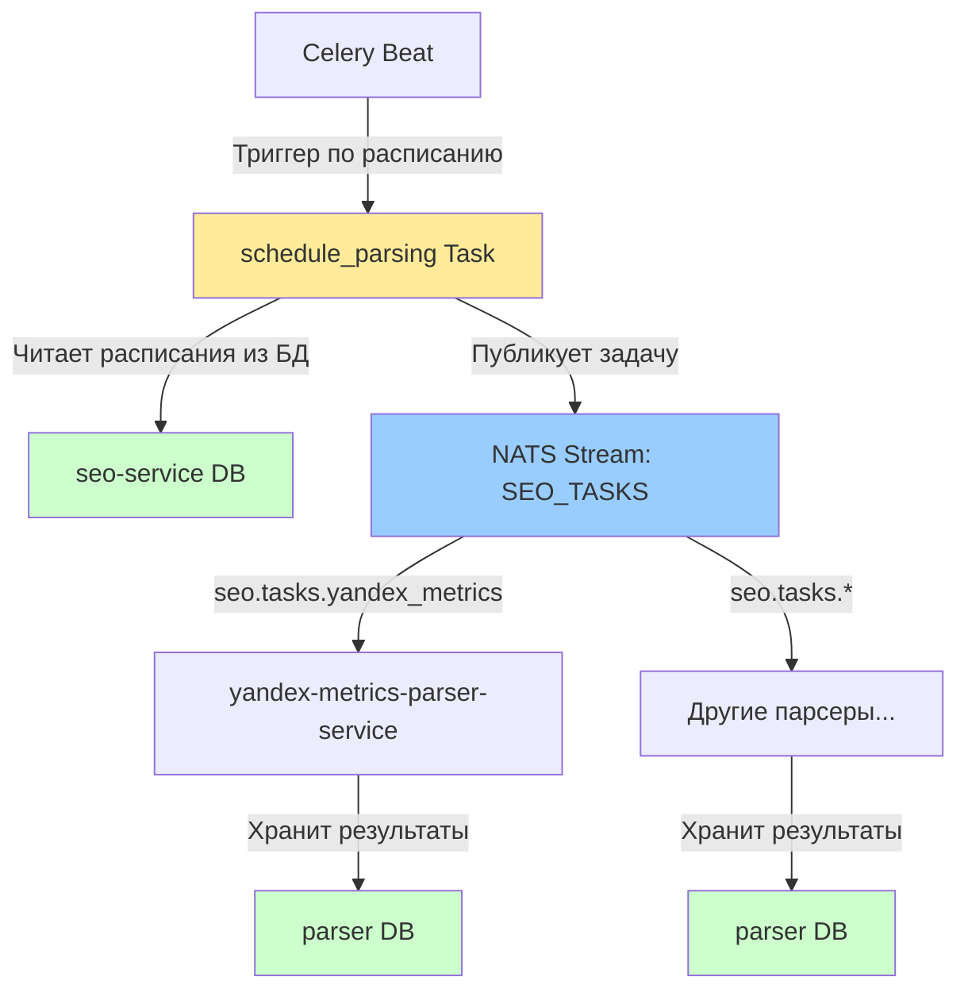

# Архитектура SEO-модуля

Данный документ описывает архитектуру SEO-модуля EqSiteCMS, включая взаимодействие сервисов, потоки данных и границы ответственности.

## 🎯 Общая концепция

SEO-модуль построен по **event-driven архитектуре** с разделением ответственности между:

- **Оркестратором** (`seo-service`) — управление расписаниями, постановка задач парсерам
- **Парсерами** (например, `yandex-metrics-parser-service`, `yandex-auth-service`) — сбор метрик из внешних источников
- **Инфраструктурой событий** (NATS JetStream) — асинхронная доставка задач
- **Планировщиком** (Celery Beat) — периодическая проверка расписаний

### Ключевые принципы

1. **Однонаправленный поток задач**: `seo-service` ставит задачи парсерам через NATS, результаты остаются в парсерах.
2. **Изоляция данных**: каждый парсер хранит собранные метрики в своей БД.
3. **At-least-once delivery**: NATS JetStream гарантирует доставку задач парсерам.
4. **Декларативное расписание**: `seo-service` хранит расписания парсингов в БД, Celery Beat проверяет их периодически.

---

## 🏗 Диаграмма взаимодействия



**Альтернативная ASCII-диаграмма:**

```
┌───────────────┐
│  Celery Beat  │  (периодический триггер)
└───────┬───────┘
        │
        v
┌──────────────────────────┐
│  schedule_parsing Task   │  (Celery задача в seo-service)
└──────┬────────────┬──────┘
       │            │
       v            v
  ┌────────┐   ┌─────────────────┐
  │ seo-   │   │ NATS Stream:    │
  │service │   │ SEO_TASKS       │
  │   DB   │   └────────┬────────┘
  └────────┘            │
                        ├─► seo.tasks.yandex_metrics
                        ├─► seo.tasks.* (future subjects)
                        │
        ┌───────────────┴───────────────┐
        v                               v
┌──────────────────┐          ┌──────────────────┐
│ yandex-metrics-  │          │ Другие парсеры   │
│ parser-service   │          │                  │
└────────┬─────────┘          └────────┬─────────┘
         │                             │
         v                             v
    ┌────────┐                    ┌────────┐
    │parser  │                    │parser  │
    │  DB    │                    │  DB    │
    └────────┘                    └────────┘
```

**Описание flow:**

1. **Celery Beat** запускает периодическую задачу `schedule_parsing` в `seo-service`.
2. **schedule_parsing** читает таблицу `parsing_schedules` из БД `seo-service`.
3. Для каждого активного расписания формируется NATS-message и публикуется в stream `SEO_TASKS`.
4. **Парсеры** (например, `yandex-metrics-parser-service`) подписаны на соответствующие subjects и получают задачи.
5. Парсеры собирают метрики из внешних источников и сохраняют в свои БД.
6. **Результаты парсинга НЕ возвращаются в `seo-service`** — они остаются в парсерах и предоставляются по запросу (архитектура запросов будет определена в отдельной задаче).

---

## 📦 Компоненты

### seo-service

**Роль:** Центральный оркестратор SEO-модуля.

**Ответственность:**
- Хранение расписаний парсингов (`parsing_schedules`)
- Хранение общих SEO-сущностей (`search_queries`, `site_paths` — будут добавлены в отдельной задаче)
- Постановка задач парсерам через NATS JetStream
- Предоставление API для управления расписаниями (будет в отдельной задаче)

**НЕ отвечает за:**
- Выполнение парсинга
- Хранение метрик из внешних источников
- Агрегацию результатов парсинга

### NATS JetStream

**Роль:** Инфраструктура асинхронной доставки задач.

**Stream:** `SEO_TASKS`
- **Retention:** WorkQueue (сообщения удаляются после подтверждения обработки)
- **Subjects:** `seo.tasks.*` (например, `seo.tasks.yandex_metrics`)

**Гарантии:**
- At-least-once delivery
- Persistence (задачи сохраняются на диск до обработки)
- Replay capability (возможность переобработки задач при необходимости)

### Celery + Redis

**Роль:** Планировщик периодических задач.

**Celery Beat** проверяет расписания и запускает задачу `schedule_parsing` с заданной частотой.

**Задача `schedule_parsing`:**
- Читает активные расписания из БД
- Формирует NATS-messages
- Публикует их в stream `SEO_TASKS`

### Парсеры (будущие сервисы)

**Примеры:**
- `yandex-metrics-parser-service` — парсинг метрик Яндекс.Метрики
- `yandex-auth-service` — авторизация для доступа к API Яндекс.Метрики

**Ответственность:**
- Получение задач из NATS
- Аутентификация в внешних системах
- Сбор метрик
- Сохранение результатов в своей БД

**НЕ отвечают за:**
- Управление расписаниями
- Постановку задач другим парсерам
- Агрегацию данных из других источников

---

## 🔐 Границы ответственности

| Компонент | Ownership | Хранит | Читает | Пишет |
|-----------|-----------|--------|--------|-------|
| `seo-service` | Расписания и общие сущности | `parsing_schedules`, `search_queries`, `site_paths` | БД seo-service | NATS `SEO_TASKS` |
| NATS JetStream | Инфраструктура событий | Задачи до обработки | — | — |
| Парсеры | Специфичные метрики | Метрики внешних источников | NATS `SEO_TASKS` | БД парсера |
| Celery Beat | Планирование | — | БД seo-service (через задачу) | — |

---

## 🚀 Расширяемость

### Добавление нового парсера

1. Создать новый микросервис (например, `google-analytics-parser-service`)
2. Подписать его на новый subject `seo.tasks.google_analytics`
3. Реализовать обработку задач и сохранение метрик
4. Обновить `docs/seo/services.md` с описанием нового парсера
5. Добавить subject в `docs/seo/protocols.md`

**Не требуется:**
- Изменение `seo-service` (кроме добавления записей в `parsing_schedules`)
- Изменение других парсеров
- Изменение NATS stream (если subject соответствует шаблону `seo.tasks.*`)

### Добавление новой общей SEO-сущности

1. Создать миграцию в `seo-service` для новой таблицы
2. Реализовать API для управления сущностью (если требуется)
3. Обновить документацию в `docs/seo/architecture.md`

---

## 📚 Связанная документация

- [Описание сервисов SEO-модуля](./services.md) — роли и технологии
- [Протоколы NATS и Celery](./protocols.md) — контракты сообщений и задач
- [NATS JetStream протоколы](../agents/howto/nats-jetstream-protocols.md) — общие правила работы с NATS в EqSiteCMS

---

## ⚠️ Важные ограничения

1. **Результаты парсинга НЕ возвращаются через NATS** — парсеры хранят метрики локально.
2. **seo-service НЕ собирает метрики** — он только ставит задачи и хранит расписания.
3. **Парсеры независимы** — они не взаимодействуют друг с другом напрямую.
4. **At-least-once delivery** — парсеры должны обрабатывать дубликаты задач идемпотентно.
